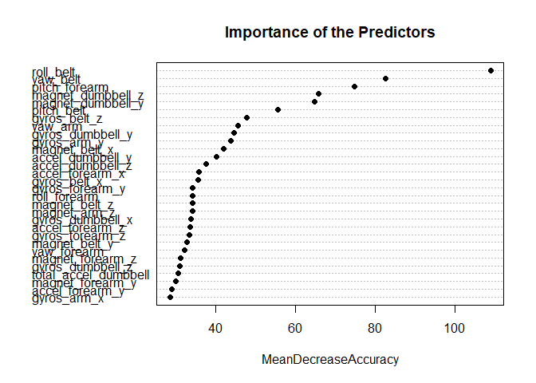

## Summary
Using devices such as Jawbone Up, Nike FuelBand, and Fitbit it is now possible to collect a large amount of data about personal activity relatively inexpensively. These type of devices are part of the quantified self movement – a group of enthusiasts who take measurements about themselves regularly to improve their health, to find patterns in their behavior, or because they are tech geeks. One thing that people regularly do is quantify how much of a particular activity they do, but they rarely quantify how well they do it. In this project, your goal will be to use data from accelerometers on the belt, forearm, arm, and dumbell of 6 participants. They were asked to perform barbell lifts correctly and incorrectly in 5 different ways. 

## Loading Necessary Packages

```r
library(caret)
library(randomForest)
```

## Reading the Data


```r
training <- read.csv("pml-training.csv",row.names=1,na.strings = "")
testing <- read.csv("pml-testing.csv",row.names=1,na.strings = "NA")
```

## Processing Data

**1. Remove near zero covariates**

```r
nsv <- nearZeroVar(training,saveMetrics=TRUE)
training <- training[,!nsv$nzv]
testing <- testing[,!nsv$nzv]
```

**2. Remove variables with missing values**

```r
training_filter_na <- training[,(colSums(is.na(training)) == 0)]
testing_filter_na <- testing[,(colSums(is.na(testing)) == 0)]
```

**3. Remove unnecessary columns**

```r
colRm_train <- c("user_name","raw_timestamp_part_1","raw_timestamp_part_2","cvtd_timestamp","num_window")
colRm_test <- c("user_name","raw_timestamp_part_1","raw_timestamp_part_2","cvtd_timestamp","num_window","problem_id")
training_colRm <- training_filter_na[,!(names(training_filter_na) %in% colRm_train)]
testing_colRm <- testing_filter_na[,!(names(testing_filter_na) %in% colRm_test)]
dim(training_colRm)
```

```
## [1] 19622    53
```

```r
dim(testing_colRm)
```

```
## [1] 20 52
```

**4. Split the processed training data into training set and validation set**

```r
inTrain <- createDataPartition(y=training$classe, p=0.7, list=FALSE)
training_clean <- training_colRm[inTrain,]
validation_clean <- training_colRm[-inTrain,]
```

In the new training set and validation set we just created, there are 52 predictors and 1 response. Check the correlations between the predictors and the outcome variable in the new training set. There doesn’t seem to be any predictors strongly correlated with the outcome variable, so linear regression model may not be a good option. Random forest model may be more robust for this data.

```r
cor <- abs(sapply(colnames(training_clean[, -ncol(training)]), function(x) cor(as.numeric(training_clean[, x]), as.numeric(training_clean$classe), method = "spearman")))
```

## Random Forest Model
We try to fit a random forest model and check the model performance on the validation set.

**1. Fit rf model**

```r
set.seed(1234)
rfFit <- train(classe ~ ., method = "rf", data = training_clean, importance = T, trControl = trainControl(method = "cv", number = 4))
validation_pred <- predict(rfFit, newdata=validation_clean)
```
**2. Check model performance**

```r
confusionMatrix(validation_pred,validation_clean$classe)
```

```
## Confusion Matrix and Statistics
## 
##           Reference
## Prediction    A    B    C    D    E
##          A 1673   10    0    0    0
##          B    0 1123    2    0    0
##          C    1    6 1020   10    3
##          D    0    0    4  953    5
##          E    0    0    0    1 1074
## 
## Overall Statistics
##                                           
##                Accuracy : 0.9929          
##                  95% CI : (0.9904, 0.9949)
##     No Information Rate : 0.2845          
##     P-Value [Acc > NIR] : < 2.2e-16       
##                                           
##                   Kappa : 0.991           
##                                           
##  Mcnemar's Test P-Value : NA              
## 
## Statistics by Class:
## 
##                      Class: A Class: B Class: C Class: D Class: E
## Sensitivity            0.9994   0.9860   0.9942   0.9886   0.9926
## Specificity            0.9976   0.9996   0.9959   0.9982   0.9998
## Pos Pred Value         0.9941   0.9982   0.9808   0.9906   0.9991
## Neg Pred Value         0.9998   0.9966   0.9988   0.9978   0.9983
## Prevalence             0.2845   0.1935   0.1743   0.1638   0.1839
## Detection Rate         0.2843   0.1908   0.1733   0.1619   0.1825
## Detection Prevalence   0.2860   0.1912   0.1767   0.1635   0.1827
## Balanced Accuracy      0.9985   0.9928   0.9950   0.9934   0.9962
```

**3. Checking important variable**

```r
imp <- varImp(rfFit)$importance
varImpPlot(rfFit$finalModel, sort = TRUE, type = 1, pch = 19, col = 1, cex = 1, main = "Importance of the Predictors")
```

<!-- -->

The random forest algorithm generates a model with accuracy 0.9913. The out-of-sample error is 0.9%, which is pretty low. We don’t need to go back and include more variables with imputations. The top 4 most important variables according to the model fit are ‘roll_belt’, ‘yaw_belt’, ‘pitch_forearm’ and ‘pitch_belt’.

## Prediction
The last step is to use the random forest model to predict on the testing set without the outcome variable and save the prediction output.

```r
testing_pred <- predict(rfFit, newdata=testing_colRm)
write_files <- function(x) {
        n <- length(x)
        for (i in 1:n) {
                filename <- paste0("problem_id", i, ".txt")
                write.table(x[i], file=filename, quote=FALSE, row.names=FALSE,col.names=FALSE)
        }
}
testing_pred
```

```
##  [1] B A B A A E D B A A B C B A E E A B B B
## Levels: A B C D E
```

## Results
We used 52 variables to build the random forest model with 4-fold cross validation. The out-of-sample error is approximately 0.9%.
